# ProcureIQ

ProcureIQ is an AI procurement intelligence system for construction teams. It ingests contracts, purchase orders, invoices, goods receipt notes, and vendor records, then uses a multi-agent workflow to detect procurement anomalies, explain vendor risk, forecast delivery delays, and keep a human reviewer in control before any action is taken.

This project was built for the Kaya AI IIT India Hackathon under Track 3: Procurement.

## Problem

Construction procurement is document-heavy and error-prone. A single project can involve hundreds of vendors, thousands of purchase orders, long contracts, delivery notes, invoices, and payment approvals. Most of this is still checked manually through disconnected spreadsheets, emails, PDFs, and ERP exports.

ProcureIQ focuses on problems that appear repeatedly in real procurement workflows:

- Invoice amounts that do not match approved purchase orders.
- Duplicate invoice submissions.
- Quantity shortfalls between ordered, delivered, and billed materials.
- Late deliveries where penalty clauses exist but are not enforced.
- Vendor risk that is not tracked across projects.
- AI outputs that need citations, audit trails, and human approval before action.

The core idea is simple: the documents already contain the evidence. ProcureIQ connects them, reasons across them, and surfaces grounded findings before money leaves the company.

## What It Does

- Ingests procurement documents through a Gatekeeper workspace.
- Runs guardrails before processing uploaded files.
- Extracts document content from PDFs and generated demo documents.
- Cross-checks invoices, purchase orders, GRNs, contracts, and vendor history.
- Produces procurement findings with severity, confidence, citations, reasoning steps, and agent trajectory.
- Lets an Auditor approve or dismiss findings through a human-in-the-loop review queue.
- Shows vendor risk, risk score components, exposure, and delivery-delay forecasts.
- Tracks operations telemetry, RAG quality, agent routing correctness, traces, and guardrail logs.

## Live Demo 🚀

| | URL |
|---|---|
| **Frontend** | https://procure-iq-liard.vercel.app |
| **Backend API** | https://procureiq-production-c4e4.up.railway.app |
| **API Docs** | https://procureiq-production-c4e4.up.railway.app/docs |

> **Status:** Live MVP — core authentication, vendor intelligence, and dashboard are fully wired to the backend. The full agentic document pipeline (OCR → LangGraph → RAG) is in active development.

## Current Demo

### Demo Credentials
Upon running the backend for the first time, default users for all roles are automatically created. You can log into the application using:

- **Admin**
  - **Email:** `admin@procureiq.demo`
  - **Password:** `admin123`

- **Auditor**
  - **Email:** `auditor@procureiq.demo`
  - **Password:** `auditor123`

- **Gatekeeper**
  - **Email:** `gatekeeper@procureiq.demo`
  - **Password:** `gatekeeper123`

- **Strategist**
  - **Email:** `strategist@procureiq.demo`
  - **Password:** `strategist123`

The demo includes:

- Command Center: portfolio KPIs, weekly risk, severity mix, and active findings.
- Review Queue: human-in-the-loop approval flow for generated findings.
- Vendor Intelligence: transparent vendor risk scoring and delivery delay forecasts.
- Document Control: upload and ingestion pipeline status.
- Operations: SLOs, latency, RAG metrics, trajectory evaluation, traces, and guardrail logs.
- Role-aware navigation for Auditor, Gatekeeper, and Strategist workflows.

## Architecture

ProcureIQ is designed as an Agentic RAG system with a frontend workspace, API layer, document pipeline, retrieval layer, agent graph, forecasting layer, and audit trail.

```mermaid
flowchart LR
  Upload["Document Upload"] --> Guardrails["Input Guardrails"]
  Guardrails --> Ingestion["Async Ingestion"]
  Ingestion --> Extraction["OCR / VLM Extraction"]
  Extraction --> Index["Hybrid Retrieval Index"]
  Index --> Supervisor["Supervisor Agent"]
  Supervisor --> Retrieval["Retrieval Agent"]
  Retrieval --> Analysis["Analysis Agent"]
  Retrieval --> WebSearch["Web Search Agent"]
  WebSearch --> Analysis
  Analysis --> Report["Report / Judge Agent"]
  Report --> Finding["Grounded Finding"]
  Finding --> Auditor["Human Approval"]
```



### Agent Roles

- Supervisor Agent: routes the task to the right specialist agents.
- Retrieval Agent: fetches relevant chunks from the right document namespace.
- Analysis Agent: compares PO, invoice, GRN, contract, and vendor evidence.
- Web Search Agent: planned layer for external vendor reputation signals.
- Report Agent: validates and formats findings before they reach a human.

### Retrieval Namespaces

The planned retrieval design separates procurement evidence by document type:

- `contracts`
- `purchase_orders`
- `invoices`
- `goods_receipts`
- `vendors`

This keeps exact identifiers such as PO numbers and invoice IDs searchable while still allowing semantic retrieval over clauses, descriptions, and evidence.

## Tech Stack

### Frontend

- React
- TypeScript
- Vite
- Framer Motion
- Recharts
- Lucide React

### Backend

- FastAPI
- Pydantic
- SQLAlchemy
- PostgreSQL, planned
- Redis and Celery, planned for queueing and background tasks
- LangGraph-style agent orchestration
- Vector search, planned
- OpenTelemetry and LangSmith-style observability, planned

### AI and Data Pipeline

- OCR/VLM document intelligence, planned
- Hybrid RAG over procurement document namespaces, planned
- Vendor risk scoring
- Forecasting layer for vendor delivery delay prediction
- Ragas-style evaluation and trajectory scoring

## Repository Structure

```text
.
  src/                         React frontend
    api/                       API client
    components/                Dashboard workspaces and shared UI
    context/                   App state, auth mode, role state
    mockData.ts                Demo fallback data
    types.ts                   Frontend data contracts

  backend/
    app/
      api/v1/endpoints/        FastAPI routes by workspace
      agents/                  Supervisor, retrieval, analysis, web search, report nodes
      core/                    Settings, RBAC, seed data, dataset schemas
      db/                      Database models and session setup
      observability/           Logging, metrics, tracing hooks
      repositories/            Data access boundaries
      schemas/                 Pydantic API contracts
      services/                Ingestion, retrieval, forecasting, evaluation, risk scoring
      tasks/                   Background worker entry points
    data/                      Seed JSON data and generated procurement PDFs
    scripts/                   Dataset and PDF generation helpers
    tests/                     Backend tests

  docs/                        Architecture and API notes
  graphify-out/                Optional shared code graph outputs
```

## API Surface

The frontend is wired to these backend routes:

- `GET /health`
- `GET /api/v1/dashboard/summary`
- `GET /api/v1/findings?status=pending`
- `POST /api/v1/findings/{finding_id}/decide`
- `GET /api/v1/vendors`
- `GET /api/v1/documents`
- `POST /api/v1/ingest`
- `GET /api/v1/operations/health`

See `docs/API_CONTRACT.md` for the route contract and `docs/ARCHITECTURE.md` for the system flow.

## Local Setup

### Frontend

```bash
npm install
npm run dev
```

The frontend expects the backend at `http://localhost:8000` by default. To point it somewhere else, set:

```bash
VITE_API_URL=http://localhost:8000
```

### Backend

```bash
cd backend
python -m venv .venv
.venv\Scripts\activate
pip install -r requirements.txt
uvicorn app.main:app --reload
```
To Load the postgres Docker before running backend

```bash
docker compose up -d postgres
```

For editable backend development:

```bash
cd backend
pip install -e ".[dev]"
pytest
```

## Demo Data

The backend includes synthetic procurement data and generated PDFs under `backend/data/`.

The dataset is shaped around realistic linked procurement records:

- Purchase orders
- Invoices
- Goods receipt notes
- Contracts
- Vendor master records

The seed scenario includes vendors such as Northstar Steelworks, Apex ReadyMix Pvt. Ltd., and Kaveri Electricals, with intentional anomaly patterns such as overbilling, duplicate invoice submission, delivery risk, and missed penalty clauses.

## Human-in-the-Loop Design

ProcureIQ deliberately does not let the AI act alone. Findings are surfaced with evidence and must be approved or dismissed by a human Auditor. This keeps the system safer for real procurement environments where false positives can affect payments, vendor relationships, and legal compliance.

Role separation:

- Gatekeeper: controls document ingestion and pipeline visibility.
- Auditor: reviews findings and approves or dismisses actions.
- Strategist: reviews portfolio-level vendor risk, exposure, and forecasts.

## Evaluation Strategy

The project is designed to evaluate more than final text quality:

- Output quality: whether the answer or finding is grounded and useful.
- Retrieval quality: whether the right PO, invoice, contract, or vendor evidence was retrieved.
- Trajectory quality: whether the Supervisor routed through the expected agent path.
- Guardrail quality: whether unsupported or ungrounded claims are blocked.

The Operations workspace already exposes RAG metrics, routing correctness, traces, and guardrail logs as part of the demo surface.

## Project Status

**Shipped & Live:**

- React/Vite dashboard with role-aware workspaces — deployed on Vercel.
- FastAPI backend with JWT authentication — deployed on Railway.
- PostgreSQL on Neon — live with seeded demo data.
- Seed procurement data and generated demo PDFs.
- Pydantic schemas for dashboard, findings, vendors, documents, and operations.
- Full RBAC: Admin, Auditor, Gatekeeper, Strategist roles.

**Active Development (Roadmap):**

- Real OCR/VLM extraction pipeline (foundation in `backend/ingestion/ocr.py`).
- Live LangGraph agent execution behind the agent module boundaries.
- Vector index integration (Pinecone index provisioned).
- Real background ingestion jobs with Celery/Redis.
- Persistent finding and document repositories.
- External vendor reputation search via web agent.
- CI/CD pipeline and automated test suite.


## Why ProcureIQ Is Different

ProcureIQ is not a generic "chat with PDF" demo. It is structured around a real procurement workflow:

- It compares documents against each other instead of answering from one file.
- It treats vendor risk as explainable, not a hidden score.
- It includes forecasting, not just retrospective anomaly detection.
- It logs agent paths and approval decisions for auditability.
- It keeps humans in control before actions are taken.

The goal is to make construction procurement faster, smarter, and more resilient without removing accountability from the people responsible for payment and vendor decisions.
