# ProcureIQ Architecture

ProcureIQ is a construction procurement intelligence system. The frontend currently uses hardcoded mock data, but its data shapes are already designed around the backend contracts in this scaffold.

## Product Flow

1. Procurement documents enter through the Gatekeeper workspace.
2. Guardrails reject unsafe, unsupported, or malformed uploads early.
3. Document intelligence extracts text, tables, identifiers, amounts, dates, line items, clauses, and visual evidence.
4. Extracted content is stored as structured records and indexed into retrieval namespaces.
5. A supervisor agent routes tasks to retrieval, optional web search, analysis, and reporting agents.
6. Findings are persisted with citations, confidence, reasoning steps, and an agent path.
7. Auditors approve or dismiss findings through a human-in-the-loop review queue.
8. Operations telemetry tracks SLOs, RAG quality, trajectory correctness, traces, and guardrail logs.

## Main Backend Layers

- API layer: FastAPI routers that match the frontend workspaces.
- Schema layer: Pydantic contracts kept close to the React mock data shape.
- Service layer: business workflows such as ingestion, retrieval, risk scoring, forecasting, and evaluation.
- Agent layer: supervisor-routed workflow nodes.
- Repository layer: database access boundaries.
- DB layer: relational entities and session management.
- Tasks layer: background jobs for slow document and AI processing.
- Observability layer: logs, traces, metrics, and evaluation reporting.

## Agent Graph

```mermaid
flowchart LR
  Upload["Document Upload"] --> Guardrails["Input Guardrails"]
  Guardrails --> DocIntel["OCR/VLM Document Intelligence"]
  DocIntel --> Index["Hybrid Index"]
  Index --> Supervisor["Supervisor Agent"]
  Supervisor --> Retrieval["Retrieval Agent"]
  Retrieval --> WebSearch["Web Search Agent"]
  Retrieval --> Analysis["Analysis Agent"]
  WebSearch --> Analysis
  Analysis --> Report["Report/Judge Agent"]
  Report --> Finding["Grounded Finding"]
  Finding --> Human["Auditor Decision"]
```

## Retrieval Namespaces

- `contracts`: contract clauses, penalty terms, rate cards, change orders
- `purchase_orders`: approved PO lines, quantities, rates, delivery dates
- `invoices`: invoice lines, tax IDs, totals, references, duplicates
- `goods_receipts`: GRNs, delivery confirmations, site receipts, images
- `vendors`: vendor history, risk signals, performance, external evidence

## Roles

- Auditor: reviews and approves or dismisses findings.
- Gatekeeper: controls document ingestion and pipeline visibility.
- Strategist: sees portfolio-level vendor and exposure summaries.

